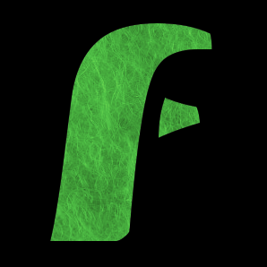
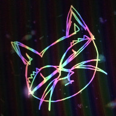
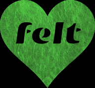

# [ryanatkn.com](https://ryanatkn.com)

> personal homepage :dolphin::rat:

1. <a href="https://felt.dev">
     felt.dev
     
   </a>
1. <a href="https://cosmicplayground.org">
     cosmicplayground.org
     
   </a>
1. <a href="https://felt.social">
     felt.social
     
   </a>
1. <a href="https://patreon.com/ryanatkn">
     patreon.com/ryanatkn
   </a>
1. <a href="https://github.com/ryanatkn">
     github.com/ryanatkn
   </a> :octopus::cat:
1. <a href="https://twitter.com/ryanatkn">
     twitter.com/ryanatkn
   </a>
1. <a href="mailto:mail@ryanatkn.com">
   mail@ryanatkn.com
   </a>✉

## credits :turtle: :turtle::turtle:

tech: [`prettier`](https://github.com/prettier/prettier),
[`github`](https://github.com), [`git`](https://git-scm.com/)

> :rainbow::sparkles: did you know? `emoji` can be punctuation :snail: neat huh

## license :bird:

[ISC](license)
permissive, [learn more at Wikipedia](https://en.wikipedia.org/wiki/ISC_license)
